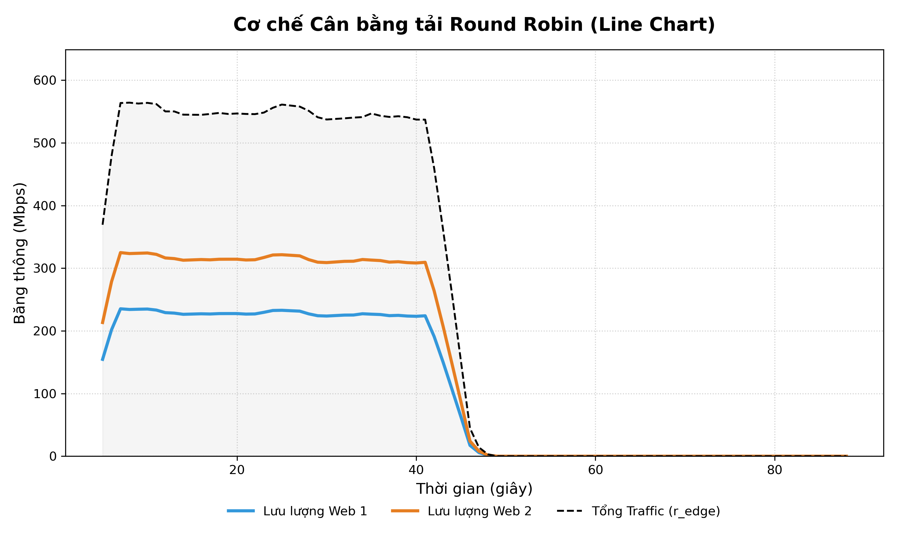
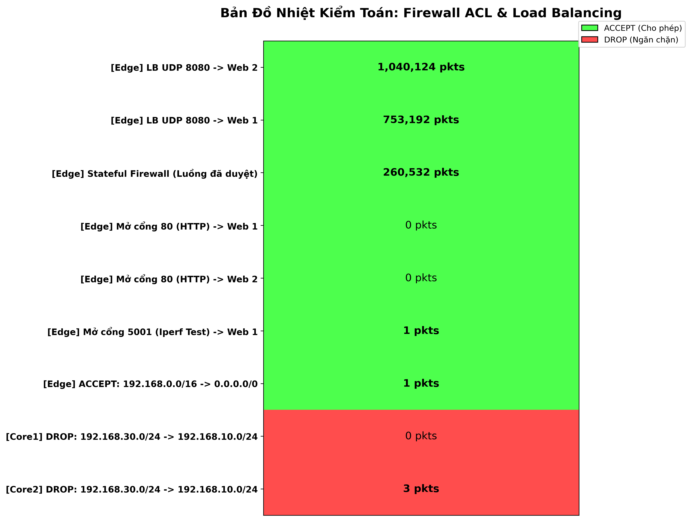
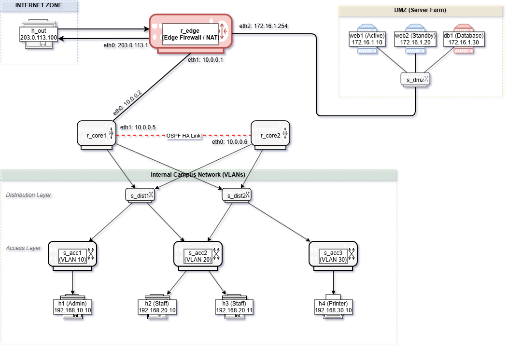

# 🌐 NetShield: Advanced Campus Network & Security Simulator


--- 

## System Preview

Below are the visual reports generated by the simulation, showcasing the load balancing distribution and the firewall audit heatmap.

<p align="center">
  
  
</p>

---

## I. The Backstory & Motivation

### Academic Context & Origin
This project was developed as the final term report for the **Advanced Computer Networks (Mạng Máy Tính Nâng Cao)** course. 

Learning about enterprise networks, dynamic routing, and security policies theoretically in a classroom often leaves a gap in practical understanding. I wanted to see firsthand how packets traverse a multi-layered network, how a router recalculates routes when a link goes down, and what actually happens to network throughput when a deep-inspection firewall is enabled.

That is why this **NetShield** was built. Instead of relying purely on network simulators like Cisco Packet Tracer, I wanted to build a realistic, Linux-based virtual network using Mininet. The core motivation was to fully understand the interaction between dynamic routing (OSPF), modern security paradigms like Zero Trust (via Stateful Firewalls & ACLs), and traffic distribution (Load Balancing) at the kernel level.

---

## II. Project Overview

### Executive Summary
- **NetShield Campus Network** is a comprehensive, multi-layer enterprise network simulation built on Mininet.
- The system mimics a standard 3-tier architecture (Core, Distribution, Access) alongside a Demilitarized Zone (DMZ) and an Edge boundary.
- It incorporates **Zero Trust Network Architecture (ZTNA)** principles via network isolation (Micro-segmentation), deep stateful packet inspection, automated OSPF routing, and a custom Round-Robin load balancer.
- Includes a custom interactive CLI to run performance tests, toggle firewalls, and generate visual audit reports.

### Tech Stack
The topology and scripts are highly modular, leveraging standard Linux networking utilities:

| Component | Technology | Role & Features |
| :--- | :--- | :--- |
| **Simulation Core** | `Mininet`<br>`Python 3` | Defines the virtual switches, hosts, and routers. Sets up namespaces and virtual Ethernet pairs (veth). |
| **Dynamic Routing** | `FRRouting (FRR)`<br>`Zebra / OSPFD` | Handles Layer 3 dynamic routing. Advertises subnets via OSPF area 0, ensuring rapid network convergence and fault tolerance. |
| **Security & NAT** | `IPTables (Netfilter)`<br>`Bash` | Implements Stateful Firewalls (Whitelisting), Subnet ACLs to block lateral movement, Masquerade (SNAT), and Port Forwarding (DNAT). |
| **Traffic & Audit** | `Iperf / Ping`<br>`Matplotlib` | Generates background traffic, monitors real-time `tx_bytes`, and plots visual heatmaps and performance comparison charts. |

---

## 🚀 Getting Started (Local Lab)

To deploy this simulation locally, follow these steps:

### 1. Prerequisites
Ensure you are running on a Linux environment (preferably Ubuntu/Debian or a Kali VM) with root privileges. Install the required packages:
```bash
# Install Mininet, FRRouting, and network tools
sudo apt update
sudo apt install mininet frr iperf iptables-persistent python3-pip

# Install Python visualization libraries
pip3 install matplotlib numpy
```

### 2. Launch the Topology
Clone the repository and run the main topology script with root privileges:
```bash
git clone https://github.com/YourUsername/MMTNC_CUOIKY.git
cd MMTNC_CUOIKY
sudo python3 scripts/topology.py
```
*Wait approximately 15 seconds for OSPF to successfully converge across the core routers.*

### 3. Interactive CLI Commands
Once the Mininet prompt (`mininet>`) appears, you can run custom operational commands:

**A. Performance & Security Testing:**
- `test_baseline` : Measures throughput and latency *before* enabling security rules.
- `firewall_on` : Injects multi-layer Firewall and ACL rules from `acl.sh`.
- `test_protected` : Re-measures throughput to evaluate firewall overhead.
- `draw_compare` : Generates a comparison bar chart.

**B. Load Balancing (Round Robin):**
- `prepare_test_rr` : Starts the UDP 8080 traffic stream and dynamic monitoring.
- `draw_rr` : Generates a line chart showing 50-50 traffic distribution.
- `heatmap_rr` : Exports a comprehensive Firewall & NAT audit heatmap.

---

## III. Network Architecture & Traffic Flow

The network is structurally divided into logical segments to enforce security and optimize routing.

<p align="center">
  
</p>

### Architecture Blueprint
- **Edge Layer:** The `r_edge` router connects to the external world. It acts as the primary shield (Stateful Firewall) and Load Balancer.
- **DMZ Segment:** Hosts public-facing services (`web1`, `web2`, `db1`). Isolated from internal workstations.
- **Core Layer:** `r_core1` and `r_core2` run OSPF for redundancy and enforce internal Access Control Lists (ACLs).
- **Access Layer:** Workstations (`h1` to `h4`) logically grouped into isolated subnets (VLANs 10, 20, 30).

### Core Network Policies

| Component | Rule/Policy | Description |
| :--- | :--- | :--- |
| **r_edge** | `Stateful Inspection` | `FORWARD DROP` default policy. Only allows `ESTABLISHED, RELATED` returning traffic, preventing unauthorized inbound access. |
| **r_edge** | `Round-Robin NAT` | Uses `iptables -m statistic --mode random --probability 0.5` to split incoming UDP 8080 traffic 50/50 between two Web Servers. |
| **r_edge** | `Masquerade (SNAT)` | Translates internal `192.168.0.0/16` IP addresses to the public Edge IP when accessing the Internet. |
| **r_core1/2**| `Subnet Isolation (ZTNA)` | Standard ACL blocks all traffic sourced from `192.168.30.0/24` destined for `192.168.10.0/24` to prevent lateral movement, enforcing a Zero Trust micro-segmentation approach. |

---

## IV. Current Limitations

As an educational Proof of Concept, the simulation has certain architectural constraints:

| Limitation | Technical Reason | Potential Risk |
| :--- | :--- | :--- |
| **Single Point of Failure** | The Edge Router (`r_edge`) is the sole gateway to the external network. | If `r_edge` goes down, the entire internal network loses internet connectivity and external users cannot access the DMZ. |
| **Statistical, not Stateful Load Balancing** | The Load Balancer relies on IPTables `random` module probability rather than actual server load or health checks. | Traffic might be sent to `web1` even if the server is overwhelmed or completely offline. |
| **High CPU Overhead** | Mininet simulates all nodes on a single host kernel. | Running intensive `iperf` tests can cause artificial bottlenecks that don't accurately reflect real hardware performance. |

---

## V. Future Roadmap

To elevate this project from a basic campus network to an enterprise-grade infrastructure simulation, the following phases are planned:

| Phase | Upgrade Module | Technical Details | Core Objective |
| :---: | :--- | :--- | :--- |
| **Phase 2** | **L7 Load Balancing** | Replace IPTables Round-Robin with a dedicated Reverse Proxy (e.g., NGINX or HAProxy) inside the DMZ. | Enable intelligent, application-layer routing, SSL termination, and active server health checks. |
| **Phase 3** | **High Availability (HA)**| Implement VRRP (Virtual Router Redundancy Protocol) using Keepalived on two Edge Routers. | Eliminate the Edge Single Point of Failure (SPOF) ensuring seamless gateway failover. |
| **Phase 4** | **Intrusion Detection (IDS)**| Deploy Snort or Suricata at the DMZ switch via port mirroring (SPAN port). | Move from passive firewalling to active threat hunting and anomaly detection. |
| **Phase 5** | **Quality of Service (QoS)**| Use Linux `tc` (Traffic Control) to prioritize HTTP/DB traffic over bulk UDP transfers. | Ensure critical application traffic is guaranteed bandwidth during network congestion. |

---

<p align="center">
  <b>Built for learning and exploring the depths of Network Engineering 🌐</b>
</p>